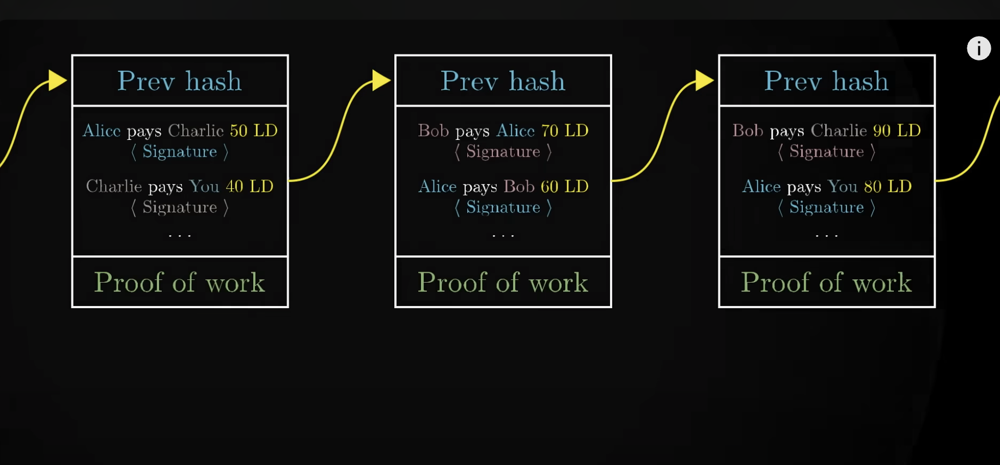

# Blockchain

**Roadmap**: https://roadmap.sh/blockchain

[Blockchain Explorer](https://www.blockchain.com/explorer?ref=mlq.ai)

## 基本概念

**基本架构**：[Blockchain Architecture Explained: How It Works & How to Build](https://mlsdev.com/blog/156-how-to-build-your-own-blockchain-architecture)
**👉 视频讲解**：[But how does bitcoin actually work? - YouTube](https://www.youtube.com/watch?v=bBC-nXj3Ng4&ab_channel=3Blue1Brown)

- **Node** - user or computer within the blockchain architecture (each has an independent copy of the whole blockchain ledger)

- **Transaction** - smallest building block of a blockchain system (records, information, etc.) that serves as the purpose of blockchain

- **Block** - a data structure used for keeping a set of transactions which is distributed to all nodes in the network (**with hash of previous block**)

- **Chain** - a sequence of blocks in a specific order

- **proof-of-work** - allows a user to **slow down** the process of creation of new blocks. In Bitcoin blockchain architecture, it takes around 10 minutes to determine the necessary proof-of-work and add a new block to the chain. This work is done by **miners** - Miners get to keep the transaction fees from the block that they verified as a reward.

  > Proof-of-work, e.g. a special number at the end of ledger that makes first 30 digits of hash zero
  > 
  >
  > 

- **Miners** - specific nodes which perform the block verification process before adding anything to the blockchain structure, **listen for transaction, do proof-of-work, creates block, and get reward (add new money)**

- **Consensus (consensus protocol)** - a set of rules and arrangements to carry out blockchain operations (**how to broadcast blocks, how nodes listen and change their own copies of blockchain**): proof-of-work (btc), proof-of-stake (eth)...

### consensus

[What Is Consensus? A Beginner’s Guide](https://crypto.com/university/consensus-mechanisms-explained)

#### proof of work

In PoW, ‘miners’ essentially **compete against one another to solve extremely complex computational puzzles** using high-powered computers. The first to come up with the 64-digit hexadecimal number (‘hash’) earns the right to form the new block and confirm the transactions.

Downside: high computation cost, high electricity consumption

e.g. bitcoin

#### proof of stake

‘validators’ **pledge a stake** of digital currency for a chance to be **randomly chosen** to validate a block, which earns them a reward. The process is not unlike a lottery, whereby the more coins staked, the better the odds.

Unlike in PoW, where miners are incentivised by block rewards (newly generated coins), those who contribute to the PoS system simply earn a transaction fee.

secure against 51% attacks, criticism for its potential to lead to centralisation

e.g. ethereum

#### proof of authority

PoA is a consensus mechanism that relies on a **fixed set of validators** to create new blocks and secure the network. Validators are typically known and reputable entities, such as banks or large corporations. Often used in private blockchains.
